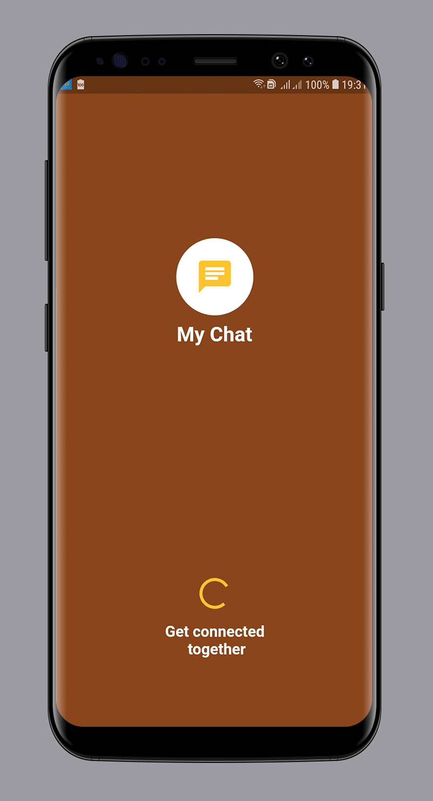

# My Chat
Building a basic chat app using flutter.This Project Is Still In Development mode.

## ***PREVIEW***

|CONTACTS | CHATS |
|     ------------- | ------------- |
| | |

## Getting Started

This project is a starting point for a Flutter application.

A few resources to get you started if this is your first Flutter project:

- [Lab: Write your first Flutter app](https://flutter.io/docs/get-started/codelab)
- [Cookbook: Useful Flutter samples](https://flutter.io/docs/cookbook)

For help getting started with Flutter, view our 
[online documentation](https://flutter.io/docs), which offers tutorials, 
samples, guidance on mobile development, and a full API reference.

## Extra Help
For extra help,email **tanamoinc@gmail.com.**

 <a class="btn btn-cta-primary" href='https://play.google.com/store/search?q=tanamo%20inc&c=apps' target="_blank">More App From Us</a>
