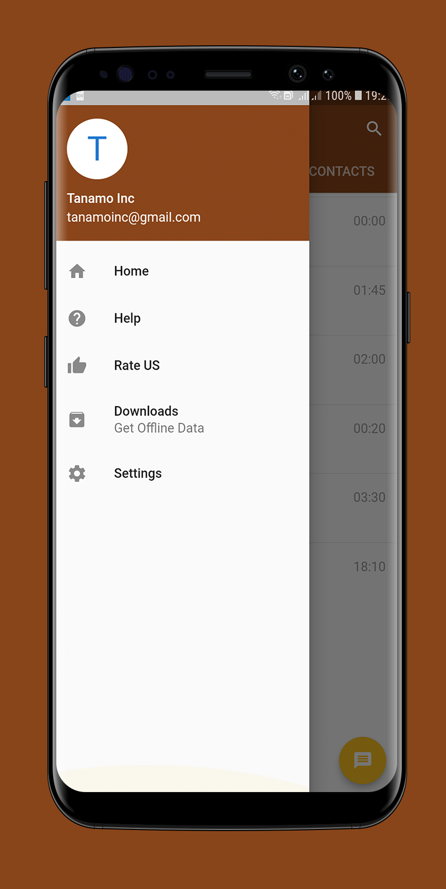
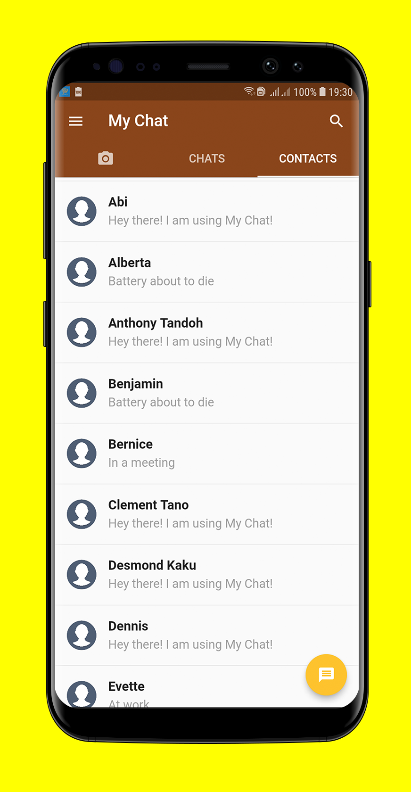

# My Chat
Building a basic chat app using flutter.This Project Is Still In Development mode.

## ***PREVIEW***

|SPLASH SCREEN|DRAWER | HOME|
|     ------------- | ------------- |
| | | |

## Getting Started

This project is a starting point for a Flutter application.

A few resources to get you started if this is your first Flutter project:

- [Lab: Write your first Flutter app](https://flutter.io/docs/get-started/codelab)
- [Cookbook: Useful Flutter samples](https://flutter.io/docs/cookbook)

For help getting started with Flutter, view our 
[online documentation](https://flutter.io/docs), which offers tutorials, 
samples, guidance on mobile development, and a full API reference.

## Extra Help
For extra help,email **tanamoinc@gmail.com.**

 <a class="btn btn-cta-primary" href='https://play.google.com/store/search?q=tanamo%20inc&c=apps' target="_blank">More App From Us</a>

MY CHEAT_SHEETS.
========================

Q.1 What is Flutter?

Flutter is Google’s mobile app SDK for crafting high-quality native interfaces on iOS and Android in
 record time.
Dart and C++ is been used to create Flutter SDK and engine.

*****************************************************************

Q.2 What is a Widget ?

 A widget in Flutter represents an immutable description of part of the user interface; all graphics,
  including text, shapes, and animations are created using widgets. 
 
 *****************************************************************
 
 
 Q.3 What is a StatelessWidget ?
 
 A stateless widget is a widget that describes part of the user interface by building a constellation
  of other widgets that describe the user interface more concretely. 
 A StatelessWidget does not require mutable state.They have no internal state and  have no widget redrawing. 
 
  *****************************************************************
  
  
  Q.4 What is a StatefulWidget ?
   
 StatefulWidget instances themselves are immutable and store their mutable state either in separate 
 State objects that are
  created by the createState method, or in objects to which that State subscribes, for example Stream 
  or ChangeNotifier objects,
   to which references are stored in final fields on the StatefulWidget itself.They have internal state 
   and  have widget redrawing. 
 
 
  *****************************************************************
  
 Q.5 What is a Column ?

 Column is also layout widget. It takes a list of children and arranges them vertically. By default, 
 it sizes itself to fit its
 children horizontally, and tries to be as tall as its parent.

 *****************************************************************
  Q.6 What are controllers ?
  
  Controllers are a means to give control to the parent widget over its child state. 
  They can be used to customize the behavior of a widget.

 
  *****************************************************************
 
 